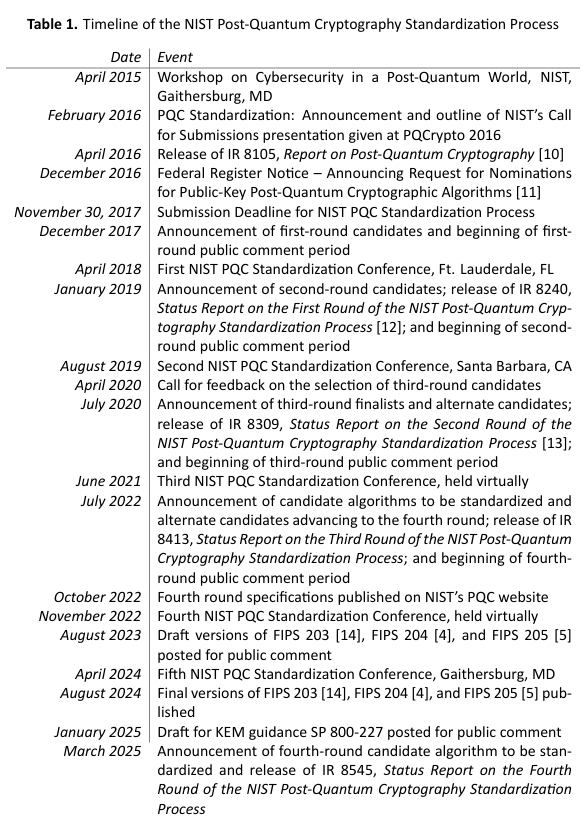

### 25.09.24-26 [6th PQC Standardization Conference](https://csrc.nist.gov/events/2025/6th-pqc-standardization-conference)

#### [NIST PQC Standardization Project](https://csrc.nist.gov/Presentations/2025/nist-pqc-project) Dustin Moody (September 24, 2025)

#### [SP 800-227: Recommendations for Key-Encapsulation Mechanisms](https://csrc.nist.gov/Presentations/2025/sp-800-227-recommendations-for-key-encapsulation-m) Gorjan Alagic (September 25, 2025)

### 25.09.18. [NIST Publishes SP 800-227](https://csrc.nist.gov/News/2025/nist-publishes-sp-800-227)

“Recommendations for Key-Encapsulation Mechanisms”

#### 25.07.29 PQC Hybrid 검증 안내 [발표](https://www.ncsc.go.kr/main/cop/bbs/selectBoardArticle.do?bbsId=CryptoNotice_main&nttId=213309&pageIndex=1&searchCnd2=)

- [암호모듈 구현 안내서](https://www.ncsc.go.kr/main/cop/bbs/selectBoardArticle.do?bbsId=CryptoNotice_main&nttId=221869&pageIndex=1&searchCnd2=) C.5 양자내성 암호를 활용한 하이브리드 방식

#### 800-227 4.6. Multi-Algorithm KEMs and PQ/T Hybrids

- [ETSI TR 103 966 v1.1.1.](https://www.etsi.org/deliver/etsi_tr/103900_103999/103966/01.01.01_60/tr_103966v010101p.pdf) 부록 A.3 교차 확인

### 25.03.11. [NISTIR 8545](https://csrc.nist.gov/pubs/ir/8545/final)

“Status Report on the Fourth Round of the NIST Post-Quantum Cryptography Standardization Process”

#### 공식 타임라인

<!--  -->

#### HQC 선정

- 4라운드 후보로 선정된 알고리즘들은 NIST에서 판단하기에 모두 바로 표준으로써 사용 가능한 알고리즘들이었음
- 주요 평가 기준은 (1) 안전성 (2) 비용 및 성능 (3) 알고리즘 및 구현 특성으로 해당 기준에 따른 자세한 평가 내용은 다음과 같음
- (1) 안전성: 각 알고리즘은 서로 다른 안전성 수준을 가지며, NIST는 HQC의 안전성이 BIKE의 안전성보다 더 높은 신뢰도를 가진다고 봄
- (2) 비용 및 성능: 캡슐화 키와 암호문 크기 & 각 알고리즘의 계산 효율성(속도). HQC가 BIKE보다 더 빠르게 동작하며, McEilece는 구성 알고리즘간 속도의 차이가 매우 크기 때문에 범용성이 떨어짐. 키와 암호문의 크기는 HQC보다 BIKE가 효율적이며, 이는 McEilece보다도 나은 성능임. McEliece는 암호문은 작지만 캡슐화 키가 매우 커 TLS 1.3에 적절하지 않음
- (3) 구현 특성: McEliece를 솔루션으로 활용 가능한 환경에 대하여 요청했으나, 결과 보고가 많지 않았으며, 해당 환경을 위한 별도의 암호 자산 목록을 구성하는 방식은 PQC 전환 측면에서 암호화 민첩성을 제공하기 어렵게 만듦
- NIST의 표준화 목적은 일반적인 환경에서 활용 가능한 KEM을 사용할 수 있도록 하는 것으로 강력한 안전성과 범용성을 고려하여 HQC를 표준으로 선정함

결론

- NIST는 HQC가 ML-KEM과 충분한 상호 보완성을 가진다고 판단함. HQC는 ML-KEM과 다른 문제에 안전성을 기반하는 동시에 범용 앱에 대한 합리적 성능을 유지함
- BIKE 역시 비슷한 성질을 고려하여 표준화 후보로 선정되었으나, HQC와 유사한 기반 문제를 다루면서도 안전성은 더 낮다고 판단되어 표준으로 함께 선정하지 않음
- HQC의 표준화는 약 2년정도 소요될 것으로 예상함

### 24.11.12. [NISTIR 8547](https://csrc.nist.gov/pubs/ir/8547/ipd)

“Transition to Post-Quantum Cryptography Standards”

#### 4.1. NIST Cryptographic Algorithm Standards and Guidelines

- Acceptable: FIPS 또는 SP에 정의된 알고리즘 및 키 길이/강도가 관련 지침에 따라 사용이 승인됨
- Deprecated: 알고리즘과 키 길이/강도를 사용할 수는 있으나 일부 보안 위험이 존재함 (데이터 중요도에 따라 사용 결정)
- Disallowed: 해당 알고리즘, 키 길이/강도, 매개변수 집합 또는 체계가 명시된 목적에 더 이상 허용되지 않음
- Legacy use: 알고리즘, 체계 또는 매개변수 집합이 이미 보호된 정보(예: 암호문 데이터의 복호화 또는 디지털 서명의 검증)를 처리하는 데에만 사용될 수 있음

Table 1: Post-Quantum Security Categories

| **Security Category** | **Attack Type** | **Example** |
| --- | --- | --- |
| 1 | Key search on a block cipher with a 128-bit key | AES-128 |
| 2 | Collision search on a 256-bit hash function | SHA-256 |
| 3 | Key search on a block cipher with a 192-bit key | AES-192 |
| 4 | Collision search on a 384-bit hash function | SHA3-384 |
| 5 | Key search on a block cipher with a 256-bit key | AES-256 |

Table 2: Quantum-vulnerable digital signature algorithms

| **Digital Signature Algorithm Family** | **Parameters** | **Transition** |
| --- | --- | --- |
| **ECDSA**  [FIPS186] | 112 bits of security strength | *Deprecated* after 2030  *Disallowed* after 2035 |
|  | ≥ 128 bits of security strength | *Disallowed* after 2035 |
| **EdDSA**  [FIPS186] | ≥ 128 bits of security strength | *Disallowed* after 2035 |
| **RSA**  [FIPS186] | 112 bits of security strength | *Deprecated* after 2030  *Disallowed* after 2035 |
|  | ≥ 128 bits of security strength | *Disallowed* after 2035 |

Table 3: Post-quantum digital signature algorithms

| **Digital Signature Algorithm Family** | **Parameter Sets** | **Security Strength** | **Security Category** |
| --- | --- | --- | --- |
| **ML-DSA**  [FIPS204] | ML-DSA-44 | 128 bits | 2 |
|  | ML-DSA-65 | 192 bits | 3 |
|  | ML-DSA-87 | 256 bits | 5 |
| **SLH-DSA**  [FIPS205] | SLH-DSA-SHA2-128[s/f], SLH-DSA-SHAKE-128[s/f] | 128 bits | 1 |
|  | SLH-DSA-SHA2-192[s/f], SLH-DSA-SHAKE-192[s/f] | 192 bits | 3 |
|  | SLH-DSA-SHA2-256[s/f], SLH-DSA-SHAKE-256[s/f] | 256 bits | 5 |
| **LMS, HSS**  [SP800208] | With SHA-256/192, With SHAKE256/192 | 192 bits | 3 |
|  | With SHA-256, With SHAKE256 | 256 bits | 5 |
| **XMSS, XMSS^MT**  [SP800208] | With SHA-256/192, With SHAKE256/192 | 192 bits | 3 |
|  | With SHA-256, With SHAKE256 | 256 bits | 5 |

Table 4: Quantum-vulnerable key-establishment schemes

| **Key Establishment Scheme** | **Parameters** | **Transition** |
| --- | --- | --- |
| **Finite Field DH and MQV**  [SP80056A] | 112 bits of security strength | *Deprecated* after 2030  *Disallowed* after 2035 |
|  | ≥ 128 bits of security strength | *Disallowed* after 2035 |
| **Elliptic Curve DH and MQC**  [SP80056A] | 112 bits of security strength | *Deprecated* after 2030  *Disallowed* after 2035 |
|  | ≥ 128 bits of security strength | *Disallowed* after 2035 |
| **RSA**  [SP80056B] | 112 bits of security strength | *Deprecated* after 2030  *Disallowed* after 2035 |
|  | ≥ 128 bits of security strength | *Disallowed* after 2035 |

Table 5: Post-quantum key-establishment schemes

| **Key Establishment Scheme** | **Parameter Sets** | **Security Strength** | **Security Category** |
| --- | --- | --- | --- |
| **ML-KEM**  [FIPS203] | ML-KEM-512 | 128 bits | 1 |
|  | ML-DSA-768 | 192 bits | 3 |
|  | ML-DSA-1024 | 256 bits | 5 |

Table 6: Block ciphers

| **Block Cipher** | **Parameter Sets** | **Security Strength** | **Security Category** |
| --- | --- | --- | --- |
| **AES**  [FIPS197] | AES-128 | 128 bits | 1 |
|  | AES-192 | 192 bits | 3 |
|  | AES-256 | 256 bits | 5 |

Table 7: Hash functions and XOFs

| **Hash/XOF Algorithm Family** | **Variants** | **Collision Security Strength** | **Collision Security Category** | **Preimage Security Strength** | **Preimage Security Category** |
| --- | --- | --- | --- | --- | --- |
| **SHA-1**  [FIPS180] | SHA-1 | 80 bits | < 1 | 160 bits | 1 |
| **SHA-2**  [FIPS180] | SHA-224, SHA-512/224 | 112 bits | < 1 | 224 bits | 3 |
|  | SHA-256, SHA-512/256 | 128 bits | 2 | 256 bits | 5 |
|  | SHA-384 | 192 bits | 4 | 384 bits | 5 |
|  | SHA-512 | 256 bits | 5 | 512 bits | 5 |
| **SHA-3**  [FIPS202] | SHA3-224 | 112 bits | < 1 | 224 bits | 3 |
|  | SHA3-256 | 128 bits | 2 | 256 bits | 5 |
|  | SHAKE128 | 128 bits | 2 | 128 bits | 2 |
|  | SHA3-384 | 192 bits | 4 | 384 bits | 5 |
|  | SHA3-512 | 256 bits | 5 | 512 bits | 5 |
|  | SHAKE256 | 256 bits | 5 | 512 bits | 5 |

### 24.10.24. [NISTIR 8528](https://csrc.nist.gov/pubs/ir/8528/final)

“Status Report on the First Round of the Additional Digital Signature Schemes for the NIST Post-Quantum Cryptography Standardization Process”

##### [Table 1]

22.07, 서명 포트폴리오 다양화를 위해 추가 전자서명 모집함을 공고.

이미 격자 기반 서명 방식 두 가지가 표준화되었기 때문에, 격자를 사용하지 않는 추가 범용 서명 방식과 짧은 서명과 빠른 검증 속도를 갖춘 서명 방식에 특별한 관심을 표명

22.09, call for proposal 발표

23.06, 50개 패키지 접수

23.07, 40개가 1차 라운드 후보로 승인

- *1차 후보 결정 기준: C 코드 구현, KAT, 서면 사양서, 필수 지적 재산권 진술서 등 (안전성, 성능, 알고리즘 및 구현 등은 고려하지 않음)**

24.04, 5차 NIST PQC 표준화 컨퍼런스

24.10, 14개의 서명 알고리즘을 2차 라운드 후보로 선정

- 2*차 후보 결정 기준: 안전성, 성능, 기반 문제 등의 알고리즘 특성*
- *격자 기반은 CRYSTALS-Dilithium과 Falcon 모두보다*

*적어도 하나의 압도적 성능 우위 제공*

- *비격자 기반은 SPHINCS+보다 적어도 하나의 압도적 성능 우위 제공*

25.01.17 개선 패키지 제출 마감 (해당 패키지로 평가)

25.09 NIST PQC 표준화 컨퍼런스 예정

2026 3라운드 평가를 위한 결선 진출자 선정

#### [Table 2] 굵은 글씨가 2라운드 선정 알고리즘

| 기반문제 | 알고리즘 |  |
| --- | --- | --- |
| Code-Based | **CROSS** |**LESS** |
|| Enhanced pqsigRM | MEDS|
|| FuLeeca | WAVE |
| Lattice-Based | EagleSign | **HAWK**|
|| EHTv4 | HuFu|
|| HAETAE | Raccoon|
||| SQUIRRELS |
| MPC-in-the-Head | Biscuit |**PERK**|
|| **Mirath**(MIRA + MiRitH) |**RYDE**|
|| **MQOM** | **SDitH** |
| Multivariate | 3WISE | **QR-UOV**|
||DME-Sign | **SNOVA**|
|| HPPC | TUOV |
|| **MAYO** | **UOV** |
|| PROV | VOX |
| Other | ALTEQ | PREON |
|| eMLE-Sig 2.0 | Xifrat1-Sign.I |
|| KAZ-SIGN | |
| Symmetric-Based | AIMer |**FAEST**|
|| Ascon-Sign |  SPHINCS-alpha |
| Isogeny-Based | **SQIsign** |  |

*제출 문서 기준으로 평가함*

#### **선정기준**

**선정기준1.  안전성**

EUF-CMA 안전성, 보안 강도 1,2와 가능한 3 충족 및 4,5 중 하나 이상 만족, 부채널 공격과 오류주입 공격등에 대한 저항성, 프로토콜 호환성

**선정기준2. 성능 및 비용**

- 공개 키와 서명의 크기
- 서명 및 검증 연산의 계산 효율성, 키 생성의 계산 효율성 (= 속도)
- 메모리: SW 구현을 위한 RAM 사용량과 HW 구현을 위한 게이트 수

**선정기준3. 활용 유연성**

플랫폼 호환성, 병렬처리 가능성

**선정기준4. 지적 재산권**

#### **[2라운드 알고리즘 선정 이유]**

| --- | --- |
| CROSS | SLH-DSA보다 나은 성능을 보이는 비격자 기반 방식 안전성에 집중한 버전과 성능에 집중한 버전으로 나뉨. 모든 매개변수 집합에서 공개 키가 작고, SLH-DSA와 비슷한 검증 속도를 보임. 키 생성은 ML-DSA와 유사한 정도로 매우 빠르고, 서명 시간도 SLH-DSA보다 나음 |
| LESS | LESS signatures are smaller than SLH-DSA with much larger public keys. 최근 동일한 공개 키 크기에서 더 작은 서명을 생성하는 방법이 제안되어 개선의 여지가 있음. 안전성 추가 검증 필요 |
| HAWK | Falcon과 문제 구성 및 성능이 유사하지만, 키 및 서명 크기 측면에서 더 우수하며, 부동소수점 연산 없이 구현 가능함. 단, Falcon보다 안전성 연구가 덜 이뤄짐 |
| Mirath | 1라운드의 두 알고리즘은 SLH-DSA와 Falcon 사이의 키 크기를 갖는 매개변수 세트를 제공하며, 서명 크기는 SLH-DSA와 유사함. 키 생성 성능은 ML-DSA와 유사하며, 서명 및 검증 성능은 ML-DSA와 Falcon 사이에 위치함. 두 알고리즘 통합으로써 서명 크기가 개선될 것으로 예상되며, 기본적인 안전성 가정은 변하지 않을 것으로 보임 |
| MQOM | 매우 작은 공개 키. 서명 크기는 ML-DSA와 SLH-DSA 사이의 중간 크기. 성능 트레이드오프와 서명 크기가 개선될 것으로 기대됨 |
| PERK | ML-DSA보다 느리고 SLH-DSA와 비슷한 속도일 것으로 예상. PERK 서명의 크기는 ML-DSA보다 크지만 SLH-DSA보다는 상당히 작을 것으로 예상. 안전성 보완 연구 필요 |
| RYDE | MPCitH 및 VOLEitH 서명 방식 범주에서 경쟁력 있는 성능을 보여주었으며, 특히 최근 개선 사항을 고려하여 선정 |
| SDitH | 전체적인 성능은 SLH-DSA보다 우수하지만, ML-DSA나 Falcon보다는 떨어짐. 매우 작은 키. SLH-DSA의 작고 빠른 매개변수 집합 사이에 위치하는 서명 크기. 추가적인 안전성 분석 및 성능 개선을 기대함 |
| UOV | 짧은 서명과 매우 빠른 서명 및 검증 속도. 오랜 기간 수행된 안전성 검증. 단, 단점은 공개 키의 크기. 제출 패키지는 공개 키 크기와 검증 속도 간의 절충안을 제공하지만, 작은 공개 키조차도 상당히 큼. 작은 서명, 빠른 검증, 그리고 키의 오프라인 전송이 필요한 애플리케이션에 적용될 것으로 예상. 비판적 안전성 분석 추가 연구 필요 |
| MAYO | UOV에 비해 공개 키 크기를 크게 줄이면서 UOV의 작은 서명 크기를 유지. UOV만큼 빠르지는 않지만, 그래도 매우 효율적 |
| QR-UOV | 공개 키가 UOV에 비해 50% 더 작음. QR-UOV의 성능은 UOV보다 느리지만 여전히 경쟁력 있음. 단, 구조 및 안전성에 대한 연구 필요 |
| SNOVA | UOV에 비해 훨씬 작은 공개 키(MAYO와 비슷하거나 약간 작음), 제출 알고리즘 중 암호 분석에 대해 가장 작은 공개 키임. 상대적으로 빠른 성능 유지. MAYO보다 약간 느리지만 비슷한 범위의 속도. 안전성은 약간 의문 |
| FAEST | 유사한 MPCitH 방식에 비해 서명 크기가 상당히 작음. 이론적 안전성은 대칭 키 가정에만 기반하고 있지만, 해당 속성을 가진 대부분의 다른 방식, 특히 SLH-DSA보다 성능이 훨씬 뛰어남. 단, 성능은 ML-DSA와 FN-DSA 같은 격자 기반 방식과는 경쟁력이 없음 |
| SQIsign | 알려진 공격들에 저항성을 가짐. 1차 라운드 후보들 및 ML-DSA와 Falcon을 포함한 모든 방식 중에서 가장 작은 공개 키와 서명 크기. 서명 및 검증의 계산 효율성 측면에서, 매우 느리지만, 검증은 서명보다 훨씬 빠름 |