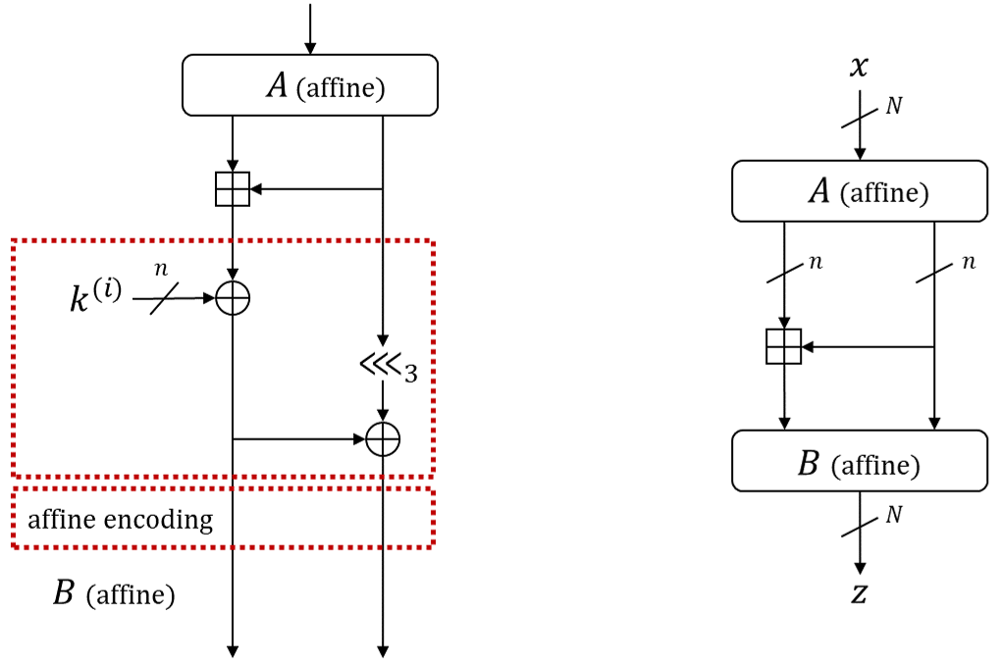
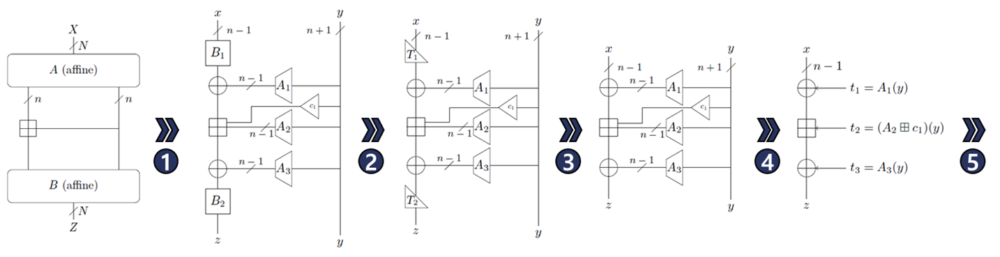

# ARX-WBC (2)

date: 2025년 12월 9일
slug: arx-wbc-attack-paper-2
author: June
status: Private
tags: Paper, WBC
type: Post

<aside>
📚

**[MAIN]** Alex Biryukov, Baptiste Lambin, and Aleksei Udovenko.
”Cryptanalysis of arx-based white-box implementations.”
IACR Transactions on Cryptographic Hardware and Embedded Systems, 2023(3):97135, 2023.

**[Sub 1]** Adrián Ranea, Joachim Vandersmissen, and Bart Preneel.
”Implicit white-box implementations: White-boxing arx ciphers.”
In Annual International Cryptology Conference, pages 3363. Springer, 2022.

**[Sub 2]** Adrián Ranea and Bart Preneel.
”On self-equivalence encodings in white-box implementations.”
Cryptology ePrint Archive, Paper 2020/1325, 2020.

</aside>

# Birykov’s Attack

## Black-box Decomposition of an ARX Round

### Affine encoding

I/O encoding이 모두 affine일 때 SE가 아니어도 성립하는 공격 기법

공격 대상: $\mathbb{O}=B\circ S\circ A$

전략: $\mathbb{O}(x)=B\circ S\circ A(x)=z$를  $\mathbb{O}(x,y)=(B\circ S\circ A(x),\ y)=(z,y)$로 바꿈

비선형 연산은 $S$에서만 이뤄지고, 선형 연산부는 encoding에 흡수시킬 수 있음

선형 연산부를 조정하여 비선형 연산이 $z$에만 영향을 미치도록 조정하면, 비선형 연산은 $x\boxplus y\mapsto z$로만 이어지며 $y\mapsto y$에 영향이 없음

1. **Locating linear bits**
    
    *Encoding 부에서 선형 부분공간을 구별함으로써 구조를 단순화하고 추후 수행될 공격이 적용될 범위를 축소함*
    
    
    
    ARX round를 $S$-layer에 affine encoding $(A,B)$를 추가한 형태로 볼 때, encoding을 제외한 라운드 함수가 $S(x\| y)=(x\boxplus y\|y)$라는 성질을 활용함
    
    $\mathbb{O}$의 $A,B$는 affine map이므로 $S$의 basis transform만 수행하는 것으로 볼 수 있음
    
    ⇒  $n+1$ 개 선형 관계를 찾아 basis transformation을 통해 분석하기 쉬운 구조로 전환
    
    $x, y$ 조정
    
    - $x:\ (x_{n-1}, x_{n-2}, ...\,, x_{1}, {\color{red} x_0})\to (x_{n-1}, x_{n-2}, ...\,, x_{1})$
    - $y:\ (y_{n-1}, y_{n-2}, ...\,, y_{0})\to ({\color{red}y_n=x_0\oplus y_0},\; y_{n-1}, y_{n-2}, ...\,, y_{0})$
    - $c_1$ (unknown with $A$) $:\ carry(x'_0, y'_0)=carry({\color{red} y'_n}\oplus y'_0,\ y'_0)$
    
    $\pi_x, \pi_z$: affine projection maps s.t.
    
    $$
    \mathbb{O}'=\pi_z\circ\mathbb{O}\circ \pi_x^{-1}
    $$
    
    (*일반적으로 정의하는 projection  $\pi:V^n\to V$와 다름* )
    
    Then, 
    
    $$
    \mathbb{O}=\pi_z^{-1}\circ\mathbb{O}' \circ \pi_x=(\pi_z^{-1}\circ B')\circ S\circ (A'\circ \pi_x)
    $$
    
    이때, $A', B'$은  $\mathbb{O}'= B'\circ S\circ A' =\pi_z\circ\mathbb{O}\circ \pi_x^{-1}$가 성립하는 affine encoding
    
    - $\pi_x$의 구조를 고려할 때 역함수가 존재하지 않지만, 직관적 표기를 위해 inverse 표기함
        
        순차적으로 진행되는 공격에 대하여 projection map의 적용과 branch의 분리는 2개의  layer로 바라봐야 함. projection map에 따른 $\mathbb{O}'$의 표현은 수학적으로 엄밀하지 않으나 아래와 같이 이해할 수 있음
        
        $\pi_x, \pi_z$의 의미
        
        Line 7 $B$: $V$의 영공간을 기저로 갖는 공간의 행렬 표현
        
        - 선형 부분 공간의 기저 = non-linear part 필터링
        - Line 6에서 모은 그래프 위 점들이 공통적으로 만족하는 $n+1$개의 선형 관계를 찾아야 함
            
            $$
            \ker(V)=\{ \lambda: V\circ \lambda =0 \}\\[1em]
            
            \dim(\ker V)=\underset{\dim V}{\underbrace{(2N+1)}}\;-\underset{(\text{rank} V)\,=\,(\# \text{ pivot columns})}{\underbrace{\;[\,2N+1-(n+1)\,]\;}}=
            \underset{\text{Nullity } V}{\underbrace{n+1}}
            $$
            
        - $V$의 영공간: $V$의 모든 행과 수직, 선형 연산 결과 = 0
            
            $$
            \begin{aligned}
            \left< \lambda_X, X \right>
            \oplus
            \left< \lambda_Z, Z \right>
            \oplus \lambda_c
            &= \left< \left( \lambda_X \| \lambda_Z \| \lambda_c \right) ,\ 
            \left( X \| Z \| 1 \right) \right>\\
            &= 0
            \end{aligned}\\[.5em]
            
            \implies \left( \lambda_X \| \lambda_Z \| \lambda_c \right) \perp
            \left( X \| Z \| 1 \right)
            $$
            
        
        즉,
        
        $$
        x^{(i)}_{(1\times N)},\quad \mathbb{O}(x^{(i)})=y^{(i)}_{(1\times N)}, \quad 
        {\pi_x^{(i)}}_{\!\!(N\times 1)}, \quad 
        {\pi_z^{(i)}}_{\!\!(N\times 1)}
        $$
        
        에 대하여
        
        $$
        \underset{\qquad\qquad\qquad\qquad\;\;\;(N+\epsilon)\times(2N+1)\!\!\!\!\!\!\!\!\!\!\!\!\!\!\!\!}{\begin{pmatrix}
        x^{(1)} & \mathbb{O}(x^{(1)}) & 1\; \\[-.3em]
        \vdots & \vdots & \vdots\; \\[.2em]
        x^{(i)} & \mathbb{O}(x^{(i)}) & 1\; \\[-.3em]
        \vdots & \vdots & \vdots\; \\[.2em]
        x^{(N+\epsilon)} & \mathbb{O}(x^{(N+\epsilon)}) & 1\; 
        \end{pmatrix}}
        
        \underset{\qquad\qquad\qquad\qquad(2N+1)\times(n+1)\!\!\!\!\!\!\!\!\!\!\!\!}{
        \begin{pmatrix}
        \pi_x^{(1)} & \!\!\!\!\cdots\!\!\!\! & \pi_x^{(i)} & \!\!\!\!\cdots\!\!\!\! & \pi_x^{(n+1)} \\[1.3em]
        \pi_z^{(1)} & \!\!\!\!\cdots\!\!\!\! & \pi_z^{(i)} & \!\!\!\!\cdots\!\!\!\! & \pi_z^{(n+1)} \\[1.3em]
        c_y^{(1)} & \!\!\!\!\cdots\!\!\!\! & c_y^{(i)} & \!\!\!\!\cdots\!\!\!\! & c_y^{(n+1)}
        \end{pmatrix}}
        
        =
        
        \underset{\qquad\qquad\quad(N+\epsilon)\times(n+1)\!\!\!\!\!\!\!\!\!\!\!\!}{
        \begin{pmatrix}
        0 & \!\!\!\cdots\!\!\! & 0 & \!\!\!\cdots\!\!\! & 0 \\[-.5em]
        \vdots & & \vdots & & \vdots \\
        
        0 & \!\!\!\cdots\!\!\! & 0 & \!\!\!\cdots\!\!\! & 0 \\[-.5em]
        \vdots & & \vdots & & \vdots \\
        0 & \!\!\!\cdots\!\!\! & 0 & \!\!\!\cdots\!\!\! & 0
        \end{pmatrix}}
        $$
        
        $$
        \begin{aligned}
        \pi^{(i)}_{x1} x^{(i)}_1 + \cdots + \pi^{(i)}_{xN} x^{(i)}_N
        \;& + \;
        \pi^{(i)}_{z1} z^{(i)}_1 + \cdots + \pi^{(i)}_{zN} z^{(i)}_N + c_y^{(i)}=0
        
        \\[1em]
        
        \pi^{(i)}_{x1} x^{(i)}_1 + \cdots + \pi^{(i)}_{xN} x^{(i)}_N
        \;& = \;
        \pi^{(i)}_{z1} z^{(i)}_1 + \cdots + \pi^{(i)}_{zN} z^{(i)}_N + c_y^{(i)}
        \end{aligned}
        \\[1.5em]
        
        \qquad\implies 
        x^{(i)}_{(1\times N)}{\pi_x^{(i)}}_{\!\!(N\times 1)} =\,  y^{(i)}_{(1\times N)}
        {\pi_z^{(i)}}_{\!\!(N\times 1)}
        
        \;\;\left(\text{set }\pi_z^{(i)}\leftarrow \pi_z^{(i)}\oplus(0^{N-1}\|c_y^{(i)})\right)
        $$
        
        달리 표현하면
        
        $$
        \underset{\qquad\qquad(N+\epsilon)\times(2N+1)\!\!\!\!}{\begin{pmatrix}
        | & | & |\; \\[.2em]
        X^T & \!\!(\mathbb{O}(X))^T\!\! & 1\; \\[.1em]
        | & | & |\; 
        \end{pmatrix}}
        
        \underset{\qquad(2N+1)\times(n+1)\!\!\!\!}{
        \begin{pmatrix}
        - & \!\!\pi_X^T\!\! & - \\[1.3em]
        - & \!\!\pi_Z^T\!\! & - \\[1.3em]
        - & \!\!c_Y^T\!\! & -
        \end{pmatrix}}
        
        =
        
        X^T\pi_X^T +(\mathbb{O}(X))^T\pi_Z^T+c_Y^T=\vec 0
        $$
        
        $$
        X^T \pi_X^T =(\mathbb{O}(X))^T\pi_Z^T + c_Y^T
        $$
        
        $$
        \begin{aligned} 
        
        \pi_X X &= \pi_Z(\mathbb{O}(X))
        
        \quad\left(\text{set }\pi_Z\leftarrow \pi_Z\oplus(0^{n-1}\|c_y^T)\right)
        
        \\[1em]
        
        \pi_X (X) &= \pi_Z\circ \mathbb{O}(X)
        
        \\[1em]
        
        X = \pi_X\circ (\pi_X)^{-1} (X) &= \pi_Z\circ \mathbb{O}\circ (\pi_X)^{-1} (X)
        
        \end{aligned}
        $$
        
        $\mathbb{O}'$에 의해 right branch 정렬이 완료된 후 남은 구조로 $y$가 left branch에 영향을 미치는 영역은 다음과 같음
        
        - $A\circ\pi_x$
            - $A'$에서 left branch로 이어지는 연산 $A_1$
            - $n+1$비트 $y$의 $n+1$번째 비트 $x_0$과 $0$번째 비트 $y_0$의 인코딩 후 값인 $x_0', y_0'$에 대한 carry bit $c_1=carry(x_0', y_0')$
            - $S$-layer 연산에 사용될 $n-1$비트 $y=(y_{n-1},\,...\,,y_2,y_1)$의 인코딩 후 값 $A_2(y)$
        - $\pi_z\circ B$
            - $B'$에서 left branch로 이어지는 연산 $A_3$
        
        또한, 정렬이 완료된 후 $x$에 대한 인코딩으로 $A'$에서의 $B_1$과 $B'$에서의 $B_2$를 고려해야 함
        
        
        
        Here, $A_1, A_2, A_3, B_1, B_2$ are unknown affine maps, $c_1$ is first carry bit of the original $n$-bit addition, expressible as $c_1(y) = \left<\alpha, y\right>\cdot\left<\beta, y\right>$ for some $\alpha, \beta\in\mathbb{F}_2^{n+1}$.
        
    
    How to find $\pi_x, \pi_z$?
    
    **Algorithm 1: Recovering input/output matching affine subspaces**
    
    - **Input:** oracle $\mathbb{O}$ implementing bijective modular addition with affine encodings
    - **Output:** affine maps $\pi_X, \pi_Z$ such that $\mathbb{O}' = \pi_z \circ \mathbb{O} \circ \pi_x^{-1}$ is such that $\mathbb{O}'(x\|y) = (z\|y)$ for all $(x, y) \in \mathbb{F}_2^{n-1} \times \mathbb{F}_2^{n+1}$, with $z \in \mathbb{F}_2^{n-1}$
        1. **for** $i \in \{0, \dots, N + \epsilon - 1\}$ **do** `N+e개 입출력 쌍에 대하여`
        2. $\quad x^{(i)} \xleftarrow{\$} \mathbb{F}_2^N$    `N비트 오라클 입력 x 생성`
        3. $\quad y^{(i)} \leftarrow \mathbb{O}(x^{(i)})$   `오라클 출력 y 생성`
        4. $\quad v^{(i)} \leftarrow (x^{(i)} \| y^{(i)} \| 1)$   `그래프 위의 점 (x,y)로 볼 수 있음`
        5. **end for**
        6. $V \leftarrow$ matrix with rows $\{v^{(i)}\}_i$    `각 행 벡터가 v인 행렬 V 구성`
        7. $B \leftarrow \text{basis}(\ker V)$ so that $V \times B = 0$    `ker V가 basis인 B 생성`
        8. $(\pi_x, \pi_z, c_y) \leftarrow B^T$, where $\pi_x, \pi_z \in \mathbb{F}_2^{(n+1) \times N}$, $c_y \in \mathbb{F}_2^{(n+1) \times 1}$
        `각 행이 map이 되도록 transpose B 계산`
        9. **return** $\pi_x, \pi_z\leftarrow \pi_z\oplus(0^{n-1} \| c_y^T)$
        `affine map 상수항을 보정한 z의 affine map을 pi_z로 반환`
    
    구하려는 projection map은 $n-1$비트 $x$와 $n+1$비트 $y$를 $n+1$비트 $y$로 보내는 map이므로 $\pi:\mathbb{F}_2^{N}\to \mathbb{F}_2^{n+1}$일 것을 기대할 수 있으며 $\mathbb{O}$의 $S$-layer를 구성한 비선형 연산은 $\ker V$에 속해 나타나지 않게 될 것으로 예상할 수 있음
    
2. **Triangularization of the outer affine maps (left branches)**
    
    **Proposition 3.** Let $\Delta x = (\dots \parallel 0^k), \Delta y = 0^n$. Let $Z$ denote the set of all possible output differences $\Delta z$ of $z = x \boxplus y$. Then, $\text{rank } Z \leq n - k$. Furthermore, if $\text{rank } Z = n - k$, then $(\Delta x)_k = (\Delta z)_k = 1$, i.e., $\Delta x$ and $\Delta z$ both have shape $(\dots \parallel 1 \parallel 0^k)$.
    
    Explain) Let $\Delta x_i = x_i \oplus x'_i,\ \Delta y_i = y_i \oplus y'_i=0$. Then, $\Delta z_i = (x_i \boxplus y_i)\oplus (x'_i \boxplus y'_i)$
    
    $$
    \begin{aligned} 
    \Delta z_i & 
    =(x_{i,n-1}\oplus y_{i,n-1}\oplus c_{i,n-1},..., x_{i,0}\oplus y_{i,0}\oplus c_{i,0})\\&
    \qquad\oplus(x'_{i,n-1}\oplus y'_{i,n-1}\oplus c'_{i,n-1},..., x'_{i,0}\oplus y'_{i,0}\oplus c'_{i,0})\\& 
    
    =(x_{i,n-1}\oplus x'_{i,n-1}\oplus  c_{i,n-1}\oplus c'_{i,n-1},\;...\,, \;x_{i,0}\oplus x'_{i,0}\oplus c_{i,0}\oplus c'_{i,0})\\&
    
    =(\Delta x_{i,n-1}\oplus  \Delta c_{i,n-1},\;...\,, \;\Delta x_{i,0}\oplus \Delta c_{i,0})\qquad\footnotesize(\text{Let }\Delta c_{i,j}= c_{i,j}\oplus c'_{i,j})
    \end{aligned}
    $$
    
    Assume that $\Delta x_{i,j}\neq 1$ (i.e., $\Delta x_{i,j}=0$).
    
    Because $\Delta x_{i,j-1}=0, \Delta y_{i,j-1}=0$  implies  $(x_{i,j-1}\boxplus y_{i,j-1}) = (x'_{i,j-1}\boxplus y'_{i,j-1})$,
    
    $\Delta c_{i,j}=0$, 
    
    Then, $\Delta z_{i,j}=0 \implies \text{rank } Z$ can’t be $n-k$.
    
    $\therefore$  If $\text{rank }Z=n-k$  then  $\Delta x_{i,k}=1$ and also $\Delta z_{i,k}=1$
    
    **Algorithm 2: Triangularization of the outer maps on the left branch**
    
    - **Input:** oracle $\mathbb{O}$ implementing bijective modular addition with partially recovered affine encodings (Subsection 6.1)
    - **Output:** affine maps $\pi_x, \pi_z$ such that $\mathbb{O}' = \pi_z \circ \mathbb{O} \circ \pi_x^{-1}$ matches structure from Figure with lower triangular $T_1, T_2$
        
        
        
    - **Complexity:** $\mathcal{O}(n^2)$ queries, $\mathcal{O}(n^4)$ time
        1. $\mathbb{O}_0 \leftarrow \mathbb{O}$
        2. **for** $k \in \{0, \dots, n - 2\}$ **do**
        3.      **repeat** `try n+e time`
        4. $\quad \quad \Delta x \overset{\$}{\leftarrow} (*^{n-1-k} \parallel 0^{n+1+k})$
        5. $\quad \quad Z \leftarrow \{ \Delta \mathbb{O}_k (\Delta x) \mid n + \epsilon \text{ times} \}$
        6.      **until**  $\text{rank } Z = n - 1 - k$
            
                 `It is sufficient to query each of n-1-k unit differences`
            
        7.      solve $Z \times \alpha = (1, \dots, 1)^T$  for $\alpha = (*^{n-1-k} \parallel 0^{n+1+k})$
        8. $\quad \pi_z \leftarrow$ a linear map such that
            
                 $(\pi_z(z))_{n+1+k} = \langle \alpha, z \rangle, (\pi_z(z))_i = z_i$ for $i > n + 1 + k$
            
        9. $\quad \beta \leftarrow (\pi_z(\Delta \mathbb{O}_k(e_i))_{n+1+k} \mid n + 1 + k \leq i < 2n) \parallel 0^{n+1+k}$
        10. $\quad \pi_x \leftarrow$ a linear map such that
            
                 $(\pi_x(x))_{n+1+k} = \langle \beta, x \rangle, (\pi_x(x))_i = x_i$ for $i > n + 1 + k$
            
        11. $\quad \mathbb{O}_{k+1} \leftarrow \pi_z \circ \mathbb{O} \circ \pi_x^{-1}$
        12. **end for**
        13. **return**  $\mathbb{O}_{n-1}$

### Sparse Quadratic-Affine encoding